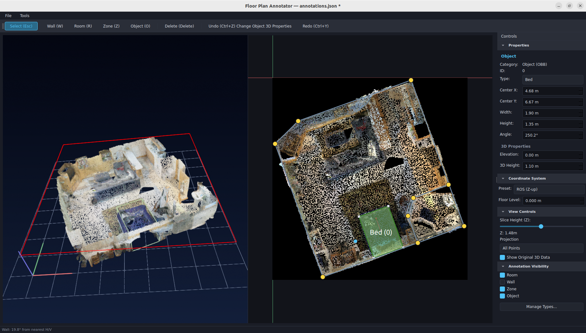

# Floor Plan Annotator

A desktop application for creating 2D floor plan annotations from 3D spatial data.

<!-- TODO: Add screenshot here -->


## Features

- **3D Data Loading** — Point clouds (PLY, PCD, OBJ, STL), meshes (GLB, GLTF), and ROS occupancy grids
- **Wall Annotation** — Draw wall segments with node snapping and alignment guides
- **Room Annotation** — Define room polygons with configurable types and colors
- **Zone Annotation** — Mark custom regions (clean zones, danger zones, etc.)
- **Object Annotation** — Place oriented bounding boxes (OBB) with move, resize, and rotate
- **3D-2D Sync** — Annotations rendered in both 2D canvas and 3D viewer
- **Height Slicing** — Extract cross-sections from 3D data at adjustable Z heights
- **Project Management** — Save/load JSON projects, auto-save, recent files

## Installation

**Prerequisites:** Python 3.10+, [uv](https://docs.astral.sh/uv/)

```bash
git clone <repository-url>
cd floor_plan_annotator

uv venv --python 3.11
uv pip install -e .
```

## Usage

```bash
python3 -m src.main
```

## Quick Start

1. **Load data** — `File > Load Point Cloud` or `File > Load Occupancy Grid`
2. **Draw walls** — Press `W`, click on the canvas to place wall segments
3. **Draw rooms** — Press `R`, click vertices to form a polygon, close it, then select a room type
4. **Draw objects** — Press `O`, drag to create a bounding box, then select an object type
5. **Save** — `Ctrl+S`

## Keyboard Shortcuts

| Action | Shortcut |
|--------|----------|
| Wall tool | `W` |
| Room tool | `R` |
| Zone tool | `Z` |
| Object tool | `O` |
| Select tool | `Esc` |
| Save | `Ctrl+S` |
| Undo | `Ctrl+Z` |
| Redo | `Ctrl+Y` |
| Copy | `Ctrl+C` |
| Paste | `Ctrl+V` |
| Delete | `Del` |

## Documentation

Full user manual is available in Korean:

> [docs/manual/index.md](docs/manual/index.md)

| Chapter | Title |
|---------|-------|
| [1](docs/manual/01_overview.md) | Interface Overview |
| [2](docs/manual/02_loading_data.md) | Loading Data |
| [3](docs/manual/03_wall_annotation.md) | Wall Annotation |
| [4](docs/manual/04_room_annotation.md) | Room Annotation |
| [5](docs/manual/05_zone_annotation.md) | Zone Annotation |
| [6](docs/manual/06_object_annotation.md) | Object Annotation |
| [7](docs/manual/07_select_edit.md) | Selection & Editing |
| [8](docs/manual/08_snap_align.md) | Snap & Alignment |
| [9](docs/manual/09_type_manager.md) | Type Management |
| [10](docs/manual/10_file_management.md) | File Management |
| [11](docs/manual/11_3d_viewer.md) | 3D Viewer |
| [12](docs/manual/12_settings.md) | Settings & Shortcuts |

## Tech Stack

- **PyQt6** — GUI framework
- **Open3D** — 3D point cloud and mesh visualization
- **NumPy / SciPy** — Numerical computation
- **Shapely** — 2D geometry operations
- **trimesh** — 3D mesh processing
- **PyYAML** — Configuration management
